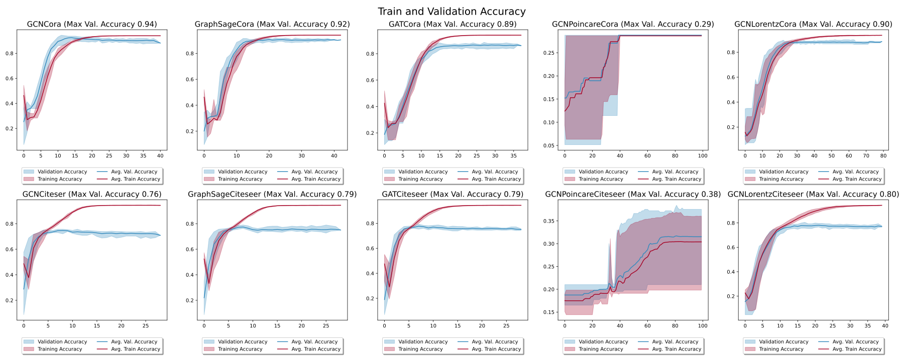

## Hyperbolic Graph Neural Networks
Graphs are ubiquitous as a form of data and machine learning on graphs has applications ranging from drug de- sign to recommendation systems. The knowledge extraction and representation from graphs using machine learning is a challenge as graphs are not structured data. Feature extrac- tion using traditional machine learning algorithms has been the go-to method to encode structural information from graphs until the advent of neural network based graph rep- resentation models. But traditional Graph Neural Network methods are limited by their ability to represent Euclidean geometries and struggle to represent datasets with a non- Euclidean latent anatomy defined by a tree-like structure. Hyperbolic embeddings offset this problem due to their abil- ity to represent these hierarchical distributions accurately. We explore Hyberbolic Graph Neural Networks through different Hyperbolic models like the Poincare ́ model and the Lorentz model.

## Running the code
GCN on Cora dataset
```
python main.py --gcn_flag --dataset="Cora" --device="cpu" \
                --embedding_dim 32 --gnn_hidden_dim 64 --mlp_hidden_dim 16 \
                 --num_epochs 100 --num_runs 10 --lr 2e-3 --weight_decay 5e-4 \--batch_size 256 --batch_norm \
                 --output_dir "output" --file_name "GCNCora" \
                 --num_workers 32 --verbose --patience 20 --model_save 
```
GraphSage on Cora dataset
```
python main.py --graphsage_flag --dataset="Cora" --device="cpu" \
                --embedding_dim 32 --gnn_hidden_dim 64 --mlp_hidden_dim 16 \
                --num_epochs 100 --num_runs 10 --lr 2e-3 --weight_decay 5e-4 --batch_size 256 --batch_norm \
                --output_dir "output" --file_name "GraphSageCora" \
                --num_workers 32 --verbose --patience 20 --model_save \
```
GAT on Cora dataset
```
python main.py --gat_flag --dataset="Cora" --device="cpu" \
                --embedding_dim 32 --gnn_hidden_dim 64 --mlp_hidden_dim 16 \
                --num_epochs 100 --num_runs 10 --lr 2e-3 --weight_decay 5e-4 --batch_size 256 --batch_norm \
                --output_dir "output" --file_name "GatCora" \
                --num_workers 32 --verbose --patience 20 --model_save \
```
HGCN Poincare Model on Cora dataset
```
python main.py --gcn_flag --dataset="Cora" --device="cpu" \
                --embedding_dim 32 --gnn_hidden_dim 64 --mlp_hidden_dim 16 \
                --num_epochs 100 --num_runs 10 --lr 2e-4 --weight_decay 5e-4 --batch_size 256 --batch_norm \
                --output_dir "output" --file_name "GCNPoincareCora" \
                --num_workers 32 --verbose --patience 20 --model_save \
                --hyperbolic_flag --hyperbolic_model "poincare"
```
HGCN Lorentz Model on Cora dataset
```
python main.py --gcn_flag --dataset="Cora" --device="cpu" \
                --embedding_dim 32 --gnn_hidden_dim 64 --mlp_hidden_dim 16 \
                --num_epochs 100 --num_runs 10 --lr 2e-4 --weight_decay 5e-4 --batch_size 256 --batch_norm \
                --output_dir "output" --file_name "GCNLorentzCora" \
                --num_workers 32 --verbose --patience 20 --model_save \
                --hyperbolic_flag --hyperbolic_model "lorentz"

```
DeepWalk on Cora dataset
```
python main.py --random_walk_flag --dataset "Cora" --device "cuda" \
               --random_walk_model "DeepWalk" \
               --embedding_dim 32 --mlp_hidden_dim 16 \
               --walk_length 10 --num_walks 10 \
               --num_epochs 10 --num_runs 2 --lr 0.01 --weight_decay 5e-4 --batch_size 32 \
               --num_workers 4 --verbose \
               --output_dir "output" --file_name "DeepWalkCora" 
```
node2vec on Cora dataset
```
python main.py --random_walk_flag --dataset "Cora" --device "cuda" \
               --random_walk_model "Node2Vec" \
               --embedding_dim 32 --mlp_hidden_dim 16 \
               --walk_length 10 --num_walks 10 \
               --num_epochs 10 --num_runs 2 --lr 0.01 --weight_decay 5e-4 --batch_size 32 \
               --num_workers 4 --verbose \
               --output_dir "output" --file_name "Node2VecCora" 
```

Similary for CiteSeer dataset, just change the dataset name to "Citeseer" in the above commands.

## Results

<figure>
  
  <figcaption>Accuracies of GNNs and HGNNs based embeddings on the Cora and CiteSeer dataset</figcaption>
</figure>

| Models   | DeepWalk | node2vec | GCN    | GraphSage | GAT    | HGCN Poincare | HGCN Lorentz |
|----------|----------|----------|--------|-----------|--------|---------------|--------------|
| Cora     | 39.80%   | 34.15%   | 73.54% | 87.38%    | 87.12% | 29.52%        | 88.82%       |
| CiteSeer | 25.80%   | 22.15%   | 76.88% | 72.13%    | 74.62% | 30.54%        | 78.11%       |

<figure>
  
  <figcaption>t-SNE plots of GNNs and HGNNs based embeddings on the Cora and CiteSeer dataset</figcaption>
</figure>